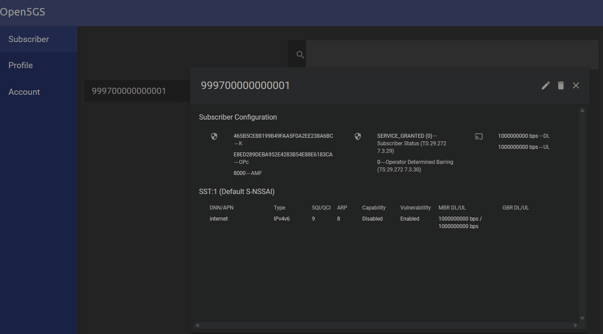

# Instalação do OPEN5GS dentro do VirtualBox para simulação da RAM

A seguir está uma explicação clara e passo a passo de como instalar o OPEN5GS dentro do VirtualBox, usando uma máquina virtual Linux, para simulação de uma rede 5G (RAN/Core). O OPEN5GS é usado para simular o núcleo da rede 5G (5GC), enquanto a RAN normalmente é simulada com ferramentas como UERANSIM.

Ubuntu v 22.04.05

## Command

```bash
 vagrant up
 vagrant ssh core
 vagrant ssh ran
 vagrant reload --provision
 vagrant reload
 vagrant halt 
 vagrant reload
 vagrant destroy
```

## Instalação

### Geral
```bash
vagrant up
```

### Core

```bash
cd /vagrant/script/
./ohmyzsh.sh
sudo apt-get update && sudo apt-get upgrade -y
./open5gs.sh
sudo nano /etc/open5gs/amf.yaml
```

Dentro /etc/open5gs/amf.yaml deixar conforme abaixo: 
```bash 
  ngap:
    server:
      - address: 192.168.56.10 
```


```bash
sudo nano /etc/open5gs/upf.yaml
```


Dentro  /etc/open5gs/upf.yaml deixar conforme abaixo: 
```bash
  gtpu:
    server:
      - address: 192.168.56.10
```


```bash
sudo systemctl restart open5gs-nrfd
sudo systemctl status open5gs-nrfd


sudo systemctl restart open5gs-amfd
sudo systemctl status open5gs-amfd

sudo systemctl restart open5gs-upfd
sudo systemctl status open5gs-upfd
```


```bash
### Enable IPv4/IPv6 Forwarding
sudo sysctl -w net.ipv4.ip_forward=1
sudo sysctl -w net.ipv6.conf.all.forwarding=1

### Enable IPv4/IPv6 Forwarding
$ sudo sysctl -w net.ipv4.ip_forward=1
$ sudo sysctl -w net.ipv6.conf.all.forwarding=1

### Add NAT Rule
$ sudo iptables -t nat -A POSTROUTING -s 10.45.0.0/16 ! -o ogstun -j MASQUERADE
$ sudo ip6tables -t nat -A POSTROUTING -s 2001:db8:cafe::/48 ! -o ogstun -j MASQUERADE

sudo iptables -I INPUT -i ogstun -j ACCEPT
```


Adicionar um usuarios:
```bash
sudo /vagrant/script/open5gs-dbctl.sh showall
sudo /vagrant/script/open5gs-dbctl.sh add 999700000000001 465B5CE8B199B49FAA5F0A2EE238A6BC E8ED289DEBA952E4283B54E88E6183CA
```

### Ran

```bash
cd /vagrant/script/
./ohmyzsh.sh
sudo apt-get update && sudo apt-get upgrade -y
./ran.sh
```

```bash
cd /vagrant/script/
./ohmyzsh.sh
sudo apt-get update && sudo apt-get upgrade -y
./ran.sh
```


Alterar as linhas abaixo do arquivo config/open5gs-gnb.yaml colocando o ip 192.168.56.11 do RANIP e o 192.168.56.10 do COREIP.
```bash
linkIp: 192.168.56.11  #127.0.0.1  # gNB's local IP address for Radio Link Simulation (Usually same wi>
ngapIp: 192.168.56.11 #127.0.0.1   # gNB's local IP address for N2 Interface (Usually same with local >
gtpIp: 192.168.56.11 #127.0.0.1    # gNB's local IP address for N3 Interface (Usually same with local >

# List of AMF address information
amfConfigs:
  - address: 192.168.56.10 #127.0.0.5
    port: 38412
```


Alterar as linhas abaixo do arquivo config/open5gs-ue.yaml
```bash
# List of gNB IP addresses for Radio Link Simulation
gnbSearchList:
  - 192.168.56.11  #127.0.0.1
```


Subir GNB:
```bash
build/nr-gnb -c config/open5gs-gnb.yaml
```

Subir UE equipamento do usuario:
```bash
sudo build/nr-ue -c config/open5gs-ue.yaml


```
Copiar os dados abaixo e cadastrar no user:
```bash
# IMSI number of the UE. IMSI = [MCC|MNC|MSISDN] (In total 15 digits)
supi: 'imsi-999700000000001'
# Permanent subscription key
key: '465B5CE8B199B49FAA5F0A2EE238A6BC'
# Operator code (OP or OPC) of the UE
op: 'E8ED289DEBA952E4283B54E88E6183CA'
```

## WEBUI

Para acessar a webui, será necessario reconfigurar o arquivo index.js para aceitar qualquer ip de configuração. Nesse caso.

```bash
nano /usr/lib/node_modules/open5gs/server/index.js
```

Alterar a linha baixo para '0.0.0.0' conforme o exemplo.
```bash
server.listen(port,'0.0.0.0', err => {
```

E também deve possuir as linhas no vangrantfile, que já está pronto.

```bash
        config.vm.network "forwarded_port",
            guest: 9999,
            host: 9999,
            protocol: "tcp",
            auto_correct: true
```


Acessa normal pelo navegardo do pc: http://localhost:9999/
user defeault e senha default


## Erros 

### Erro noble_bartender

vagrant up
Bringing machine 'core' up with 'virtualbox' provider...
Bringing machine 'ran' up with 'virtualbox' provider...
==> core: Box 'noble_bartender' could not be found. Attempting to find and install...
    core: Box Provider: virtualbox
    core: Box Version: >= 0
==> core: Box file was not detected as metadata. Adding it directly...
==> core: Adding box 'noble_bartender' (v0) for provider: virtualbox (amd64)
    core: Downloading: noble_bartender
    core:
An error occurred while downloading the remote file. The error
message, if any, is reproduced below. Please fix this error and try
again.

Couldn't open file ##/noble_bartender

### Alterar a linha dentro do vagrantfile "noble_bartender"
```bash
config.vm.box = "ubuntu/jammy64"
```


### Erro disk

```bash
 vagrant up
Bringing machine 'core' up with 'virtualbox' provider...
Bringing machine 'ran' up with 'virtualbox' provider...
==> core: Box 'ubuntu/jammy64' could not be found. Attempting to find and install...
    core: Box Provider: virtualbox
    core: Box Version: >= 0
==> core: Loading metadata for box 'ubuntu/jammy64'
    core: URL: https://vagrantcloud.com/api/v2/vagrant/ubuntu/jammy64
==> core: Adding box 'ubuntu/jammy64' (v20241002.0.0) for provider: virtualbox
    core: Downloading: https://vagrantcloud.com/ubuntu/boxes/jammy64/versions/20241002.0.0/providers/virtualbox/unknown/vagrant.box
    core:
==> core: Successfully added box 'ubuntu/jammy64' (v20241002.0.0) for 'virtualbox'!
There are errors in the configuration of this machine. Please fix
the following errors and try again:

Vagrant:
* Unknown configuration section 'disksize'.
```

### Solução: 
```bash
vagrant plugin install vagrant-disksize
```

<p align="center">
  
</p>


## Referencia

Open5GS = https://open5gs.org/open5gs/docs/guide/01-quickstart/
RAN = https://github.com/aligungr/UERANSIM 
